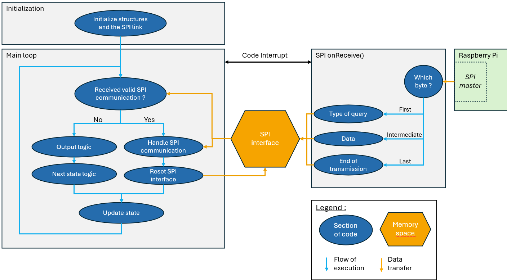
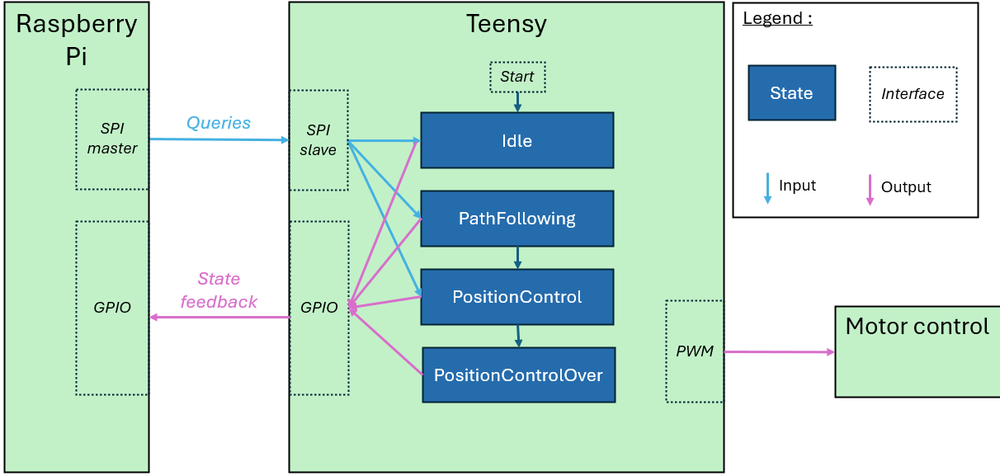

# Teensy Microcontroller: BotLightYear Project

## Overview
This repository contains the software for the **Teensy microcontroller** used in the **BotLightYear** project. The Teensy is responsible for **mid-level and low-level control** of the differential drive robot's DC motors. It receives commands via **SPI communication**, specifying the operational mode and associated parameters. The supported modes are:

- **Idle**
- **Position Control**
- **Path Following**
- **Speed Control**

---

## Operational Modes

### 1. Idle
- **Input**: None
- **Output**: No duty cycle applied to the motors.

### 2. Position Control
- **Input**: Target position (x, y, θ).
- **Output**: Adjusts motor duty cycles to reach the specified position.

### 3. Path Following
- **Input**: A set of control points (xᵢ, yᵢ).
- **Output**: The robot follows the trajectory defined by the **cubic spline interpolation** of the control points.

### 4. Speed Control
- **Input**: Left and right wheel speed references.
- **Output**: Adjusts motor duty cycles to achieve the specified speeds.

---

## File Structure

### Main Loop
- **File**: `Teensy.ino`
- **Description**: Contains the main loop

### Input-Output Interface
- **Directory**: `src/inout_interface`
- **Description**: Handles:
  - **SPI communication** (input).
  - **Encoder readings** (input).
  - **Motor duty cycle control** (output).
  - **Feedback pins** (A1, A2, A3).

### Localization
- **Directory**: `src/localization`
- **Description**: Implements robot localization using wheel encoder data.

### Speed Controller
- **Directory**: `src/regulator`
- **Description**: Determines the duty cycle for each motor based on left and right speed references.

### Position Controller
- **Directory**: `src/position_control`
- **Description**: Computes wheel speeds to reach a target position (x, y, θ). The algorithm is adapted from:
  - Siegwart, R., Nourbakhsh, I. R., & Scaramuzza, D. (2011). *Introduction to autonomous mobile robots*. MIT press.

### Path Follower
- **Directory**: `src/path_follower`
- **Description**: Computes wheel speeds to follow a trajectory defined by cubic spline interpolation of control points. The algorithm is adapted from:
  - Kim, S., Cho, H. & Jung, D. *Robust Path Following Control Via Command-Filtered Backstepping Scheme*. Int. J. Aeronaut. Space Sci. **22**, 1141–1153 (2021). [https://doi.org/10.1007/s42405-021-00395-7](https://doi.org/10.1007/s42405-021-00395-7).

---

## Code Architecture

### Concurrent Execution
The Teensy, being a **single-core microcontroller**, uses a **code interrupt** to handle SPI communication. The `onReceive()` function temporarily pauses the main loop to process incoming SPI messages.

---

## Finite State Machine (FSM) and I/O Logic

### State Transitions
The Teensy starts in **Idle mode** and transitions to other modes based on SPI commands from the Raspberry Pi. Feedback is provided to the Raspberry Pi via GPIO pins.

### Path Following Termination
The **path following mode** automatically switches to **position control** when the robot approaches the trajectory endpoint, as the algorithm is not designed for static positions.

